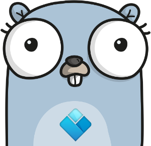
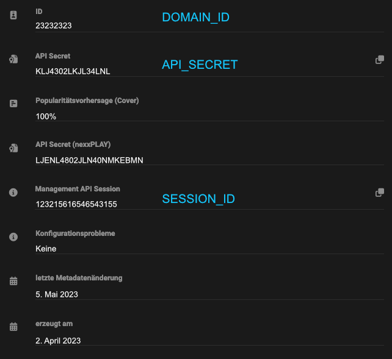

# go nexxOMNIA API

<p align="center">
  
</p>

Partial API Implementation for nexxOMNIA. This library is published as it is with no guarantee for support and/or bugfixes.

```sh
go get github.com/alex-berlin-tv/nexx_omnia_go
```


## Creating a client

In Omnia go to »Domains« and open the info panel of your Domain. There you will find the information as follows:

| Name in Frontend       | Field in Code  |
|------------------------|----------------|
| ID                     | `<DOMAIN_ID>`  |
| API Secret             | `<API_SECRET>` |
| Management API Session | `<DOMAIN_ID>`  |



```go
client := omnia.NewClient("<DOMAIN_ID>", "<API_SECRET>", "<SESSION_ID>")
```


## Get an audio file by id

```go
// Get Audio file with ID 2342
rsl, err := client.ById(enum.AudioStreamType, 2342, nil)
if err != nil {
    log.Error(err)
}
fmt.Printf("%+v", rsl.Result)
```

The structure of `rsl.Result` depends on the method used. In this instance a `omnia.MediaResultItem` will be returned.


## Change the metadata of a media item

Example for calling the update method:
```go
_, err := client.update(enum.AudioStreamType, 2342, params.Custom{
    "title": "Fnord!",
})
if err != nil {
    log.Error(err)
}
```

There is currently no hard coded parameter implementation for all available attributes you can change with the `update` method. The API provides a list with all available fields:

```go
rsl, _ := client.EditableAttributes(enum.VideoStreamType)
fmt.Printf("%+v", rsl.Result)
```
